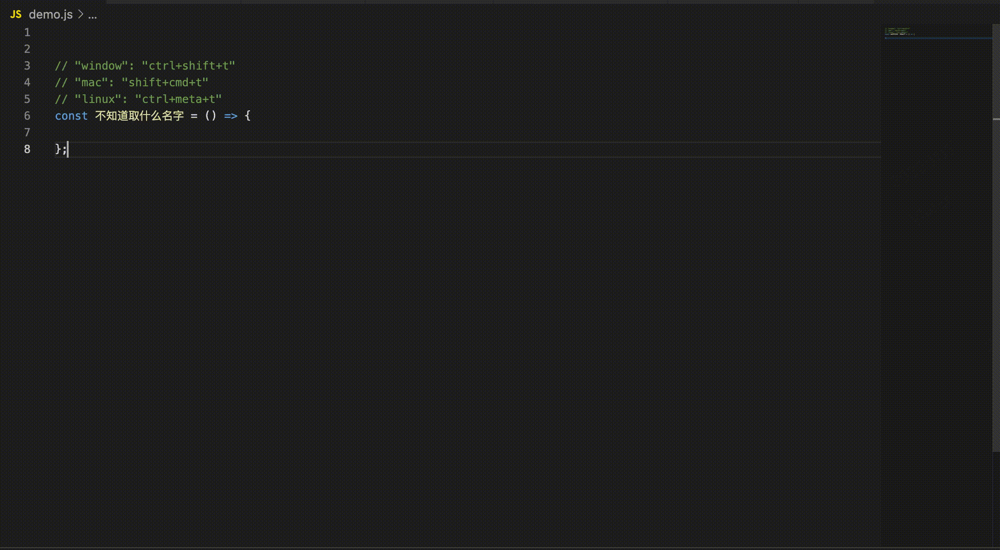
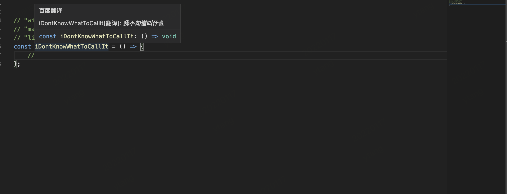

## Chinese-to-English vsCode快速翻译插件
解决程序员命名困难的问题，目前支持百度翻译，实现中文名转英文驼峰名
vscode 拓展搜索 “Chinese-to-English”

### github
https://github.com/twosugar/chinese-to-english

### 快捷键
选中文本，快捷键翻译成英文(驼峰命名的方式)
```
windows: ctrl + shift + t
mac: shift + cmd + t
linux: ctrl + meta + t
```


### 鼠标悬浮

